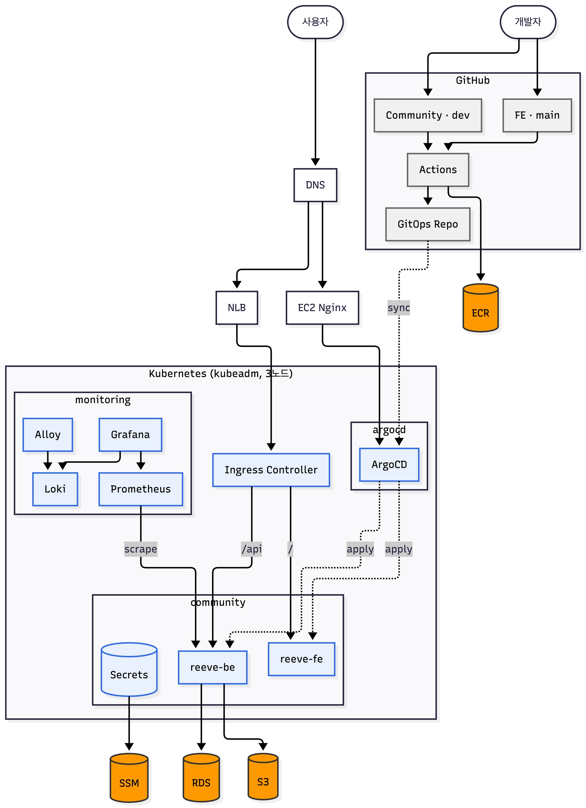
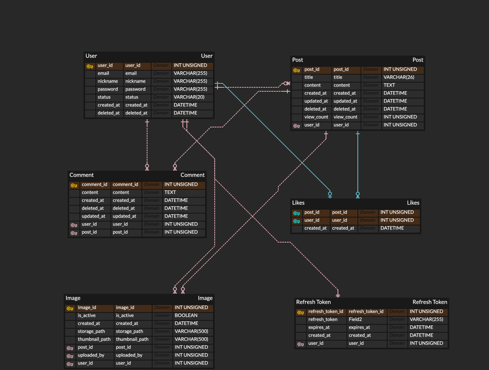

# 여행모퉁이 (reeve-community)

> 아무도 모르는 곳에서 발견한 이야기 — 국내 숨은 여행지를 나누는 커뮤니티 서비스입니다.


🔗 배포 링크: [여행모퉁이](https://k8s.reeve.o-r.kr/html/index.html)  
🔗 Front-end Repository: [100-hours-a-week/4-reeve-community-FE](https://github.com/100-hours-a-week/4-reeve-community-FE)

---

## Back-end 소개

- 개인의 여행 경험과 숨은 장소를 공유하고 소통하는 커뮤니티 서비스의 백엔드입니다.
- Spring Boot, Spring Data JPA, QueryDSL 기반으로 REST API를 구현했습니다.
- MySQL을 주 데이터베이스로 사용하고, 운영 환경에서는 AWS RDS와 연동합니다.
- JWT 기반 인증을 사용하며, Access Token은 응답 body로 전달하고 Refresh Token은 httpOnly Cookie로 관리합니다.
- 게시글/프로필 이미지 업로드, 이미지 압축, 프로필 썸네일 생성, S3 업로드를 지원합니다.
- GitHub Actions, ECR, GitOps 저장소, ArgoCD 흐름을 통해 컨테이너 이미지를 빌드/배포합니다.

## 개발 기간 및 인원

- 개발 기간: 2026-05-30 ~ 2026-08-09 
- 개발 인원: 백엔드/인프라 1명 (본인) — reeve.joo(주영진)

## 사용 기술 및 Tools

**Application**

- Java 26
- Spring Boot 4.0.6
- Spring Web MVC
- Spring Data JPA
- Spring Security
- Spring Validation
- Spring Actuator
- QueryDSL 5.1.0
- MySQL
- Lombok
- JJWT 0.12.6
- AWS SDK for Java v2 S3
- Thumbnailator
- Scrimage / WebP
- p6spy

**Infra / DevOps**

- Docker
- GitHub Actions
- AWS ECR
- AWS RDS
- AWS S3
- AWS SSM Parameter Store
- GitOps Repository
- ArgoCD
- Kubernetes
- Nginx
- Prometheus / Grafana / Loki / Grafana Alloy

## 폴더 구조

<details>
<summary>폴더 구조 보기/숨기기</summary>

```text
Community
├── deploy
│   ├── be-user-data.sh
│   └── docker-compose.yml
├── nginx
│   ├── Dockerfile
│   └── nginx.conf
├── src
│   ├── main
│   │   ├── java/com/example/community
│   │   │   ├── auth
│   │   │   ├── comment
│   │   │   ├── global
│   │   │   ├── image
│   │   │   ├── likes
│   │   │   ├── post
│   │   │   └── user
│   │   └── resources
│   │       ├── application.yml
│   │       └── application-prod.yml
│   └── test
├── Dockerfile
├── build.gradle
├── settings.gradle
└── gradlew
```

</details>

---

## 아키텍처



## 서버 설계

### 서버 구조

| Domain | Controller | Service | Repository | Entity |
| --- | --- | --- | --- | --- |
| Auth | AuthController | AuthService | RefreshTokenRepository | RefreshToken |
| User | UserController | UserService | UserRepository | User |
| Post | PostController | PostService | PostRepository | Post |
| Comment | CommentController | CommentService | CommentRepository | Comment |
| Like | LikesController | LikesService | LikesRepository | Likes |
| Image | ImageController | ImageService | ImageRepository | Image |

### 구현 기능

**Auth**

- 로그인
- 로그아웃
- Access Token 발급
- Refresh Token Rotation 기반 토큰 재발급
- Refresh Token httpOnly Cookie 저장

**User**

- 회원가입
- 회원 정보 조회
- 회원 정보 수정
- 회원 탈퇴
- 이메일 중복 확인
- 닉네임 중복 확인
- 비밀번호 변경
- 프로필 이미지 등록 / 변경 / 제거

**Post**

- 게시글 목록 조회
- 게시글 상세 조회
- 게시글 작성
- 게시글 수정
- 게시글 삭제
- 게시글 조회수 비동기 증가
- 게시글 좋아요 수 관리

**Comment**

- 게시글 상세 조회 시 댓글 목록 조회
- 댓글 작성
- 댓글 수정
- 댓글 삭제

**Like**

- 게시글 좋아요
- 게시글 좋아요 취소
- 중복 좋아요 방지
- 좋아요 수 증감 처리

**Image**

- 게시글 이미지 업로드
- 프로필 이미지 업로드
- 이미지 삭제
- JPG 압축 저장
- 프로필 이미지 WebP 썸네일 생성
- 운영 환경 S3 업로드
- 업로드 후 게시글/프로필에 연결되지 않은 orphan 이미지 정리

**Global**

- 공통 응답 래퍼
- 전역 예외 처리
- JWT 인증 필터
- CORS 설정
- Actuator health / prometheus endpoint 노출

## API 요약

| Method | Path | Description | Auth |
| --- | --- | --- | --- |
| POST | `/api/auth` | 로그인 | Public |
| POST | `/api/auth/refreshToken` | 토큰 재발급 | Refresh Token Cookie |
| DELETE | `/api/auth` | 로그아웃 | Required |
| POST | `/api/users` | 회원가입 | Public |
| GET | `/api/users?email={email}` | 이메일 중복 확인 | Public |
| GET | `/api/users?nickname={nickname}` | 닉네임 중복 확인 | Public |
| GET | `/api/users/{userId}` | 회원 정보 조회 | Required |
| PATCH | `/api/users/{userId}` | 회원 정보 수정 | Required |
| DELETE | `/api/users/{userId}` | 회원 탈퇴 | Required |
| PATCH | `/api/users/{userId}/password` | 비밀번호 변경 | Required |
| GET | `/api/posts` | 게시글 목록 조회 | Public |
| GET | `/api/posts/{postId}` | 게시글 상세 조회 | Public |
| POST | `/api/posts` | 게시글 작성 | Required |
| PATCH | `/api/posts/{postId}` | 게시글 수정 | Required |
| DELETE | `/api/posts/{postId}` | 게시글 삭제 | Required |
| POST | `/api/posts/{postId}/comments` | 댓글 작성 | Required |
| PATCH | `/api/posts/{postId}/comments/{commentId}` | 댓글 수정 | Required |
| DELETE | `/api/posts/{postId}/comments/{commentId}` | 댓글 삭제 | Required |
| POST | `/api/posts/{postId}/likes` | 좋아요 | Required |
| DELETE | `/api/posts/{postId}/likes` | 좋아요 취소 | Required |
| POST | `/api/images/posts` | 게시글 이미지 업로드 | Required |
| POST | `/api/images/profile` | 프로필 이미지 업로드 | Required |
| DELETE | `/api/images/{imageId}` | 이미지 삭제 | Required |

## ERD



> *현재 코드 기준으로 `Post` 엔티티에는 `likeCount`가 있고, `RefreshToken` 엔티티의 토큰 컬럼은 `token`입니다.

## 인증 방식

- 로그인 성공 시 `accessToken`을 응답 body로 내려줍니다.
- Refresh Token은 `refreshToken` 이름의 httpOnly Cookie로 저장합니다.
- Refresh Token Cookie는 `Secure`, `SameSite=Strict`, `path=/api/auth` 설정을 사용합니다.
- 인증이 필요한 API는 `Authorization: Bearer {accessToken}` 헤더를 우선 사용하며, `accessToken` Cookie도 함께 지원합니다.
- Access Token 만료 시 FE가 `/api/auth/refreshToken`으로 재발급을 요청할 수 있습니다.

## 이미지 처리

- 업로드 가능한 파일 형식은 JPG, PNG, WebP입니다.
- 최대 업로드 크기는 10MB입니다.
- 게시글 이미지는 JPG로 압축 저장합니다.
- 프로필 이미지는 JPG 원본 경로와 150px WebP 썸네일 경로를 함께 저장합니다.
- 운영 환경에서는 S3에 `image/post/`, `image/profile/`, `image/thumbnail/` prefix로 업로드합니다.
- 24시간 이상 게시글/프로필에 연결되지 않은 비활성 이미지는 매일 새벽 3시에 정리합니다.

## 성능 최적화

`/api/posts` 목록 조회 API를 대상으로 k6 부하테스트(`ramping-arrival-rate`)를 반복 진행하며 병목을 찾고 개선했습니다. 아래는 그 중 가장 비중 있게 진행한 HikariCP 커넥션 풀 튜닝 과정과, 그 과정에서 JFR(Java Flight Recorder)로 추가 발견한 병목까지의 요약입니다.

**적용된 런타임 설정** (아래 테스트는 이 값을 기준으로 진행됨)

| 항목 | 값 |
| --- | --- |
| GC | G1GC |
| Heap 상한 | `-XX:MaxRAMPercentage=70` → 컨테이너 메모리 700Mi 기준 약 490Mi |
| Tomcat `threads.max` / `accept-count` | 50 / 25 |
| HikariCP `maximum-pool-size` (최종) | 15 |

### 1) HikariCP 커넥션 풀 크기 조정

- HikariCP 공식 사이징 공식(`(core_count × 2) + effective_spindle_count`)을 기준으로 파드당 `maximum-pool-size=5`로 초기 설정
- 부하테스트 결과, pool=5에서는 커넥션 대기(pending)가 25~26건까지 쌓이며 SLA(p95<1000ms)를 위반
- Little's Law로 필요 동시 커넥션을 재계산해 `maximum-pool-size=15`로 조정 → pending이 거의 0으로 해소되고 SLA 통과
  | | pool=5 | pool=15 |
  | --- | --- | --- |
  | p95 | 1.74s (SLA 위반) | 880ms (SLA 통과) |
  | avg | 515.79ms | 292.53ms |
  | HikariCP pending 피크 | 25~26 | 0에 가까움 |

### 2) JFR 프로파일링으로 찾은 추가 병목

pool 조정 이후에도 BE 파드 CPU가 97%까지 치솟는 현상이 남아, JFR로 CPU 사용처를 직접 분석해 두 가지 원인을 확인했습니다.

- **MySQL PreparedStatement 재파싱** — MySQL Connector/J 기본값(`cachePrepStmts=false`)으로 인해 동일한 쿼리도 요청마다 새로 파싱되고 있었음 → `cachePrepStmts=true`, `prepStmtCacheSize=250`, `useServerPrepStmts=true` 등 캐싱 옵션을 JDBC URL에 적용
- **Hibernate `CoercionException` 반복 발생** — IN절에 리스트를 `setParameter()`로 그대로 넘기면 Hibernate가 먼저 단일값으로 추정했다가 실패(예외 발생)한 뒤 재시도하는 경로를 타고 있었고, 요청당 평균 1.39회 발생
  첫 시도(쿼리를 positional → named parameter로만 변경)는 효과가 없었습니다 — CoercionException 발생률이 1.39회→1.38회로 사실상 그대로였고, 응답시간도 오히려 나빠졌습니다. 스택 트레이스를 다시 분석한 결과, 원인은 파라미터 이름 방식이 아니라 **`setParameter()`가 아닌 Hibernate 전용 `setParameterList()`를 써야 하는 것**이었습니다. `EntityManager.unwrap(Query.class).setParameterList()`로 전환한 뒤에야 개선이 나타났고, 같은 패턴이 PostRepository 외에 CommentRepository, ImageRepository에도 남아있어 순차적으로 모두 적용했습니다.

| 단계 | CoercionException 발생률(요청당) |
| --- | --- |
| 수정 전 | 1.39회 |
| PostRepository named parameter만 변경 | 1.38회 (효과 없음) |
| + CommentRepository 적용 | 0.478회 |
| + ImageRepository 적용 | 0회 (168,454건 요청 기준) |

MySQL 캐싱 옵션과 Hibernate 쿼리 수정을 함께 반영한 뒤 200 RPS 부하테스트 결과:

| | 개선 전 | 개선 후 |
| --- | --- | --- |
| p95 | 3.57s (SLA 위반) | 421ms (SLA 통과) |
| avg | 1.03s | 92ms |
| CPU 피크 | 99% | 76.9% |
| Tomcat busy 최대(상한 50) | 50 (포화) | 12 |

### 3) 부가 발견 — JIT 컴파일러 warm-up 비용

350 RPS까지 부하를 올리는 과정에서, 막 재시작한 파드는 JIT(C2) 컴파일러가 아직 핫 경로를 학습하지 못해 컴파일 자체가 CPU의 상당 부분(전체 CPU의 약 7.7%)을 차지한다는 것을 JFR로 확인했습니다. 이후 부하테스트 전에 낮은 RPS로 2~3분간 예열 트래픽을 흘려서 이 노이즈를 줄이는 절차를 추가했습니다.

### 현재 확인된 성능 경계

- **200 RPS**: SLA(p95<1000ms) 안정적으로 통과 — p95 421ms, CPU 76.9%
- **350 RPS**: SLA 위반(p95 2.13s) — CPU(93.7%), Tomcat busy(50=상한), HikariCP pending(30+)이 동시에 포화되는 것으로 확인했습니다. 코드 버그가 아니라 현재 파드 스펙(CPU 500m, Tomcat 50 threads, HikariCP pool 15)에서 나타나는 물리적 한계로 판단하고 있습니다.
- 정확한 임계 RPS(200~350 사이 어딘가로 추정)는 아직 특정하지 못했습니다.


## 실행 방법

```bash
./gradlew bootRun
```

기본 context path는 `/api`입니다.

## 테스트

```bash
./gradlew test
```

현재 단위 테스트는 `UserService` 일부 회원가입 검증 로직을 중심으로 구성되어 있습니다.

## 배포

- Docker multi-stage build로 Spring Boot 실행 이미지를 생성합니다.
- 별도 Nginx 이미지를 함께 빌드해 Spring Boot 컨테이너 앞단 프록시로 사용합니다.
- GitHub Actions가 이미지를 빌드하고 AWS ECR에 push합니다.
- GitOps CD workflow는 GitOps 저장소의 `apps/reeve-be/values.yaml` 이미지 태그를 갱신합니다.
- 운영 배포 스크립트는 AWS SSM Parameter Store에서 비밀값을 읽어 컨테이너 환경 변수로 주입하고, 운영 profile은 AWS RDS와 S3 설정을 사용합니다.
